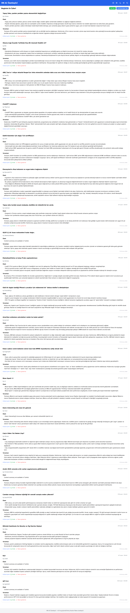
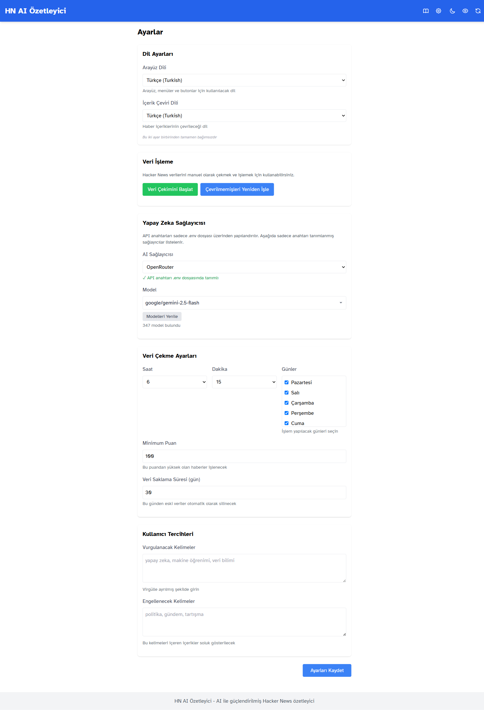

<p align="center">
  
</p>

<h1 align="center">HN AI Summarizer</h1>

<p align="center">
  <strong>Turn hours of Hacker News reading into a personalized daily briefing.</strong>
</p>

<p align="center">
  Read the signal. Skip the noise.
</p>

<p align="center">
  ✅ AI Summaries &nbsp;&middot;&nbsp;
  🌍 Read in Your Language &nbsp;&middot;&nbsp;
  🎯 Personalized Feed &nbsp;&middot;&nbsp;
  📬 Telegram Notifications &nbsp;&middot;&nbsp;
  🏠 Self Hosted
</p>

---

> Every day, Hacker News publishes more great content than most of us have time to read.
>
> **HN AI Summarizer** automatically reads the top stories, summarizes them with AI, translates them into your language, and delivers a personalized digest every morning.

> **Spend less time reading. Keep more of what matters.**

---

# 🔄 Flow

```

HN Stories
↓
AI Summarization
↓
Translation
↓
Personalized Feed
↓
Telegram Notification

````

---

# Why?

Most Hacker News readers face the same problem:

- There are too many interesting stories.
- Popular discussions easily reach hundreds of comments.
- Great articles disappear before you have time to read them.
- Reading everything simply isn't realistic.

HN AI Summarizer solves that problem by doing the reading for you.

---

# Without vs With

| Without | With |
|----------|------|
| Browse dozens of stories manually | Read concise AI summaries |
| Spend 45–60 minutes | Spend around 10 minutes |
| English only | Read in your own language |
| Information overload | Personalized daily briefing |
| Miss stories while sleeping | Wake up to a curated digest |

---

# ✨ Features

## ⏱ Save Time

Every story is condensed into a short, easy-to-read summary so you can quickly decide what deserves your attention.

---

## 🌍 Read in Your Language

Translate stories into more than 20 languages.

Read the interface in one language while reading articles in another.

---

## 🎯 Personalized Feed

Highlight stories that match your interests.

Interested in:

- AI
- Rust
- Security
- Startups
- PostgreSQL

Only the stories you care about stand out.

---

## 📬 Telegram Delivery

Receive a notification as soon as your daily briefing is ready.

No need to remember checking Hacker News.

---

## 🏠 Self Hosted

Run everything on your own server.

- Your API keys stay with you.
- Your database stays with you.
- No subscriptions.
- No vendor lock-in.

---

## 🔄 Fully Automated

While you sleep, HN AI Summarizer:

- fetches new stories
- summarizes them
- translates them
- stores everything
- prepares your morning briefing

Wake up and start reading.

---

## 📖 Comfortable Reading

Designed for long reading sessions.

- Large typography
- High contrast
- Mobile friendly
- Tablet friendly
- Desktop friendly

---

# 🚀 Quick Start

```bash
git clone https://github.com/RecNes/hn-ai-summarizer.git

cd hn-ai-summarizer

cp .env.example .env

# Add one AI provider API key
# (OpenAI, Anthropic, Gemini, DeepSeek...)

docker compose --profile internal up
````

Open:

```
http://localhost:8000
```

That's it.

---

# 🖼 Screenshots

| Home                            | Settings                      |
| ------------------------------- | ----------------------------- |
|  |  |

---

# 🤖 Supported AI Providers

* OpenAI
* Anthropic Claude
* Google Gemini
* DeepSeek
* OpenRouter
* Ollama
* LM Studio

Only one provider is required.

---

# 🌐 Supported Languages

Supports 20+ languages including:

* English
* Turkish
* German
* French
* Spanish
* Italian
* Portuguese
* Russian
* Japanese
* Korean
* Chinese

...and more.

---

# 📖 Documentation

| Document      | Description                                |
| ------------- | ------------------------------------------ |
| [Installation](docs/INSTALLATION.md)  | Docker, Windows and local setup            |
| [Architecture](docs/ARCHITECTURE.md)  | Scheduler, workers and processing pipeline |
| [Configuration](.env.example) | Complete `.env` reference                  |

---

# 🛣 Roadmap

* Takeaway mobile app
* PDF export
* Email Delivery
* More Personalization
* Telegram enhancements

---

# ❤️ Contributing

Issues, pull requests and feature suggestions are always welcome.

If this project saves you time every morning, consider giving it a ⭐.

---

# 📜 License

MIT
